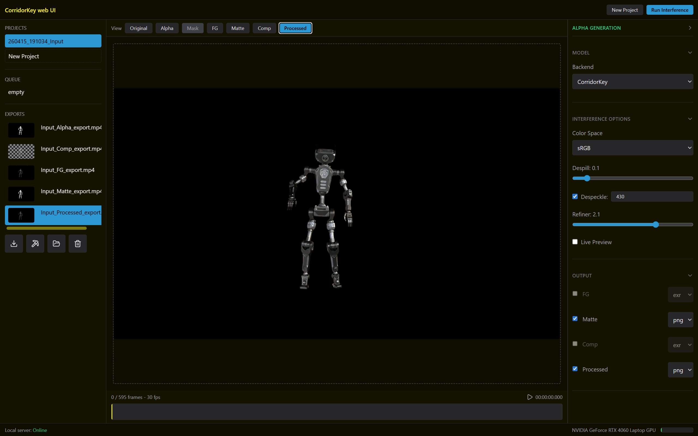

# CorridorKey web UI

Hi! This web UI was made by Arthur Adriansens. I stepped out of my comfort zone (JavaScript, Node.js and Astro) to use Python. The backend uses standard library, together with the already installed packages from CorridorKey, plus fastapi.

I wanted to avoid adding any JavaScript packages to this project, so I only used devDependencies (no package.json needed), because I want to use Tailwind CSS for faster development and maintainability.

Special thanks to EZ-CorridorKey for inspiring this project. A big part of the UI explenations are from EZ-CorridorKey.



## Developer notes

### Prerequisites

- Python 3.10 or newer: [Python downloads](https://www.python.org/downloads/)
- Node.js and npm for Tailwind development: [Node.js](https://nodejs.org/en)

### Install

Download the entire project:

```bash
git clone https://github.com/nikopueringer/CorridorKey.git
cd CorridorKey
```

Install the Python dependencies:

```bash
uv sync --group dev
```

Start the Python server:

```bash
uv run --extra cuda uvicorn webUI.server.server:app --reload
```

## FFmpeg

FFmpeg also needs to be installed.

Download FFmpeg here: [ffmpeg.org/download.html](https://ffmpeg.org/download.html)
Or:

### Windows

```bash
winget install "FFmpeg (Essentials Build)"
```

### macOS

```bash
brew install ffmpeg
```

### Ubuntu / Debian

```bash
sudo apt update && sudo apt install -y ffmpeg
```

Verify the installation:

```bash
ffmpeg -version
```

## Dev setup

Install Tailwind CSS globally and run watch mode to generate `output.css`:

```bash
npm install -g tailwindcss@3 # v4 doesn't really work without a package.json
cd webUI && tailwindcss -i static/input.css -o static/styles.css --watch # run this in a second terminal during development
```

That’s it.

## Questions?

DM [Art on Discord](https://discord.com/users/714418367209144330).
Join the [Discord](https://discord.gg/zvwUrdWXJm) — it's the fastest way to get help or discuss ideas before opening a PR.
